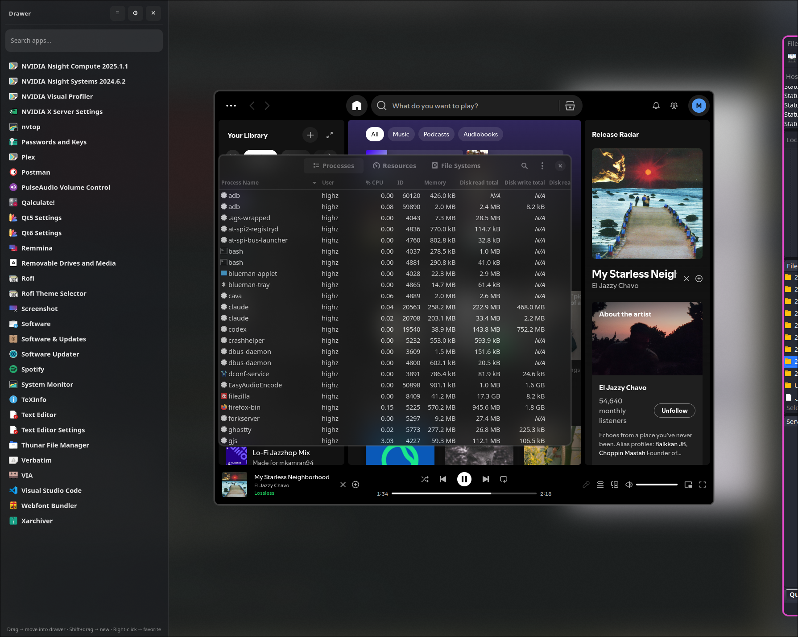

# hypr-drawer

A pop-up "drawer desktop" for [Hyprland](https://hyprland.org).

One keybind toggles a translucent, blurred overlay containing a searchable
app launcher on one side and a free-form floating space on the other. Drag an
app from the launcher into the space — it opens there, floating and
resizable. The same keybind hides the whole thing. Apps keep running; their
sizes and positions are remembered per app class.

It's a place to park "background" apps (Spotify, Discord, a notes window, a
chat client) without giving them real estate on your tiled workspaces.



> ⚠️ **Status: experimental.** This is a personal project that's usable but
> rough. The blur overlay can flicker during monitor transitions, some UI
> polish is missing, and edge cases around multi-monitor focus can leave the
> drawer in a weird state. See the latest commit messages for current known
> issues. PRs and bug reports welcome.

## How it works

Under the hood it's a thin layer on top of Hyprland primitives:

- **Special workspace** (`togglespecialworkspace`) provides the show/hide
  scratchpad behavior — Hyprland already remembers windows in there.
- **`windowrule = float, workspace:special:drawer`** keeps every window in
  the drawer floating.
- **Per-monitor blur shades**: a named special workspace is single-instance
  in Hyprland (toggling it on one monitor pulls it off the others), so
  instead of relying on `decoration { blur { special = true } }` alone, the
  daemon paints a transparent GTK4 layer-shell overlay on every monitor and
  uses `layerrule = blur` to get a consistent blurred backdrop everywhere.
- A **GTK4 layer-shell daemon** (built with [AGS v3 / Astal](https://github.com/Aylur/ags))
  draws the launcher rail, settings panel, and handles drag-and-drop.
- **Geometry** is persisted to `~/.local/state/hypr-drawer/positions.json` keyed
  by window class. App usage frequency is tracked separately for ranking.

## Requirements

- **Hyprland** — 0.53 or newer. `config/drawer.conf` uses the `match:` window-rule
  syntax introduced in 0.53; older versions will throw config errors.
- **AGS v3** (the v2 line has an incompatible API). How you get it depends on
  your distro — see below.
- `socat` (reads Hyprland's `socket2` event stream), `dart-sass` (compiles
  `app/style.scss`), and `jq`.

### AGS v3 by distro

`./install.sh` picks the right source automatically. Nix is only a **fallback**,
used where no distro package exists.

| Distro | Source | Nix needed? |
| --- | --- | --- |
| Arch, CachyOS, EndeavourOS, Manjaro | `aylurs-gtk-shell` (AUR, mirrored by chaotic-aur) | No |
| Fedora | `aylurs-gtk-shell` via [Terra](https://terra.fyralabs.com) | No, if Terra is enabled |
| Ubuntu, Debian, Linux Mint, Pop!\_OS | [Aylur's flake](https://github.com/Aylur/ags) | **Yes** |
| openSUSE | Aylur's flake | **Yes** |
| NixOS | add the flake to your own config — the installer won't touch it | n/a |

Note that **nixpkgs itself still ships AGS 2.3.0**, which is too old; the flake
ref (`github:Aylur/ags#agsFull`) is what provides v3.

Set `AGS_FORCE_NIX=1` to skip native packages and always use the flake.

If you're on a distro that needs Nix and don't have it yet:

```bash
# Determinate Systems installer (recommended for non-NixOS):
curl --proto '=https' --tlsv1.2 -sSf -L https://install.determinate.systems/nix | sh -s -- install

# …or the upstream multi-user installer:
sh <(curl -L https://nixos.org/nix/install) --daemon
```

Make sure `~/.nix-profile/bin` is on your `PATH` (the Nix installer normally
adds this to your shell rc; open a new shell after installing). Budget ~600 MB
of disk for the first Nix install, cached after that.

## Install

```bash
git clone <this-repo> hypr-drawer
cd hypr-drawer
./install.sh
```

The installer:

1. Detects your distro family from `/etc/os-release` (so derivatives like
   CachyOS and Mint resolve to arch/debian correctly).
2. Installs `socat`, `jq` and `dart-sass` via your distro PM
   (`pacman`/`apt`/`dnf`/`zypper`).
3. Installs **AGS v3** from your distro's repo where one exists, otherwise
   from `github:Aylur/ags#agsFull` into your Nix profile (bundles ags,
   astal4/GTK4, the apps service, the Hyprland module). Idempotent:
   re-running upgrades in place, and an existing v3 is left alone.
4. Verifies `ags --version` ≥ 3.x and that `sass` is on `PATH`.
5. Detects your **config provider** (see below) and drops either
   `~/.config/hypr/drawer.lua` + one `require("drawer")` line in
   `hyprland.lua`, or `~/.config/hypr/drawer.conf` + one `source = …` line in
   `hyprland.conf` (idempotent — safe to re-run).
6. Installs the daemon to `~/.local/share/hypr-drawer` and a CLI wrapper to
   `~/.local/bin/hypr-drawer`.
7. Runs `hyprctl reload`.

User-level only. The only `sudo` is whatever your package manager needs for the
runtime packages. Everything else lands under `~/.local` (plus `~/.nix-profile`
on the Nix path).

### Config providers: `hyprland.lua` vs `hyprland.conf`

Hyprland ships two config parsers in the same binary. The original hyprlang one
is now `Config::Legacy` internally; the Lua one is what a fresh install
generates, and what CachyOS ships by default. Which one runs is decided by your
config files, **not** by your Hyprland version, so the installer detects it
rather than checking a version number:

| `~/.config/hypr` contains                | provider used |
| ---------------------------------------- | ------------- |
| `hyprland.lua` (with or without `.conf`)  | lua           |
| only `hyprland.conf`                      | legacy        |
| neither                                   | lua (Hyprland generates one) |

Check yours with `hyprctl systeminfo | grep configProvider`. Override the
detection with `HYPR_PROVIDER=lua ./install.sh` or `HYPR_PROVIDER=legacy` if
you need to. If the installer picks the wrong one the failure is silent — it
writes a valid config into a file Hyprland never opens, and the hotkey simply
does nothing.

> **Note:** on the legacy path, `config/drawer.conf` sets
> `decoration { blur { … } }` globally, and the installer appends its
> `source = …` line to the end of `hyprland.conf` — so it takes precedence over
> blur settings defined earlier in your config. If you already tune blur (HyDE,
> ML4W, end-4 and similar dotfiles all do), edit the `decoration` block in
> `drawer.conf` to match yours. `config/drawer.lua` deliberately does not do
> this: it sets only `decoration.blur.special` and leaves your `size`/`passes`
> alone.

## Usage

| Action | Result |
|---|---|
| `SUPER + CTRL + R` (default) | Toggle the drawer (open or hide). |
| Type in search bar | Fuzzy filter apps by name; ranked by usage frequency. |
| **Drag** an app tile onto the workspace | If that app is already running on any workspace, **moves** that window into the drawer. Otherwise launches a new instance at the drop point. |
| **Shift+Drag** (or Ctrl+Drag) | Always launches a new instance into the drawer. |
| Click an app tile | Same as plain drag: move-if-running, otherwise launch. |
| Resize/move a window inside the drawer | Geometry is saved per class — same app reopens at the same spot. |
| Open the settings panel | Edit the toggle shortcut, tweak preferences. |
| `SUPER + CTRL + R` again | Hides the drawer. Apps keep running in the background. |

## Rebind

Two options:

- **In-app** (preferred): open the drawer, click the settings cog, and use the
  keyboard shortcut editor (supports F13–F24 and other extended keys).
- **By hand**: edit `~/.config/hypr/drawer-bind.lua` (or `drawer-bind.conf` on
  the legacy provider) — change *both* the unbind and the bind line — then
  `hyprctl reload`.

The bind file is separate from `drawer.lua`/`drawer.conf` because the daemon
**rewrites it wholesale** whenever you change the shortcut in-app, so any hand
edits there are lost the next time you touch the setting. The snippet only
`require`s (or `source`s) it. Re-running `./install.sh` will not clobber it —
the installer seeds that file only when it doesn't already exist, and the
closing banner reports whichever bind is actually live.

Applying a rebind live also differs by provider, which the daemon handles for
you: `hyprctl keyword` is rejected outright under the Lua parser
(`keyword can't work with non-legacy parsers. Use eval.`), so the Lua path
drives `hyprctl eval 'hl.bind(…)'` instead.

## State

`~/.local/state/hypr-drawer/positions.json` — one entry per window class:

```json
{
  "spotify":  { "x": 120, "y": 80, "w": 1400, "h": 900 },
  "discord":  { "x": 200, "y": 120, "w": 1200, "h": 800 }
}
```

Delete an entry to forget a window's position; delete the file to forget
everything. Settings and usage stats are stored alongside in the same
`~/.local/state/hypr-drawer/` directory.

## Uninstall

```bash
./uninstall.sh
```

Removes the hook line from `hyprland.lua`/`hyprland.conf`, the snippet, the
binary, and the app directory. Both providers are always swept, so a config
that migrated from hyprlang to Lua between install and uninstall doesn't strand
a hook pointing at a deleted file. Prompts before deleting saved positions.

## CLI

```
hypr-drawer toggle   # open or close
hypr-drawer show
hypr-drawer hide
hypr-drawer daemon   # explicit daemon start (started via exec-once normally)
hypr-drawer quit
```

## Troubleshooting

- **Nothing happens on keybind.** First check the config provider actually
  matches what was installed: `hyprctl systeminfo | grep configProvider`. If it
  says `lua` but you have a `drawer.conf`, Hyprland never read it — re-run
  `./install.sh`. Then check `pgrep -af 'ags.*hypr-drawer'`. If empty, look at
  `~/.local/state/hypr-drawer/daemon.log` for the last failed start, or run
  `hypr-drawer daemon` in a terminal to see errors live. `hyprctl binds` shows
  whether the bind is registered at all.
- **Drawer opens but no blur, or blur flickers.** Confirm
  `decoration { blur { enabled = true } }` isn't overridden later in your
  config. The per-monitor shade relies on the `layerrule = blur, drawer-shade`
  line from `drawer.conf` — run `hyprctl configerrors` and re-run
  `./install.sh` if you edited the snippet.
- **Drag does nothing.** Make sure `socat` is installed — the event watcher
  needs it to talk to Hyprland's socket2.
- **App opens but on the wrong monitor.** `hyprctl clients` coordinates are
  in global layout space; the daemon translates to local monitor space when
  placing windows. If something still lands wrong, check
  `~/.local/state/hypr-drawer/daemon.log` for the computed coordinates.
- **App opens but on the wrong workspace.** Some apps set `StartupWMClass`
  oddly; positions are keyed by lowercased class. Check `hyprctl clients` to
  see the real class and rename the entry in `positions.json`.

## Project layout

```
hypr-drawer/
├── install.sh / uninstall.sh
├── bin/hypr-drawer            # CLI wrapper
├── config/drawer.conf         # hyprland.conf snippet, legacy provider
├── config/drawer.lua          # hyprland.lua snippet, lua provider
├── packaging/deps.sh          # per-distro dep installer
└── app/                       # AGS v3 daemon (TypeScript)
    ├── app.ts                 # entrypoint, IPC, Hyprland socket2 loop
    ├── style.scss
    ├── service/
    │   ├── Apps.ts            # .desktop discovery
    │   ├── DragState.ts       # in-flight drag bookkeeping
    │   ├── Hotkey.ts          # keybind capture / serialization
    │   ├── Hypr.ts            # hyprctl wrappers
    │   ├── Layout.ts          # window placement math
    │   ├── Memory.ts          # per-class geometry persistence
    │   ├── Preview.ts         # drop-zone preview
    │   ├── Settings.ts        # user preferences
    │   ├── Spawn.ts           # launch / move-into-drawer pipeline
    │   └── Usage.ts           # frequency tracking for ranking
    └── widget/
        ├── AppTile.tsx        # launcher tile + drag source
        ├── Launcher.tsx       # rail, search, settings panel
        └── Shade.ts           # per-monitor blurred backdrop
```
